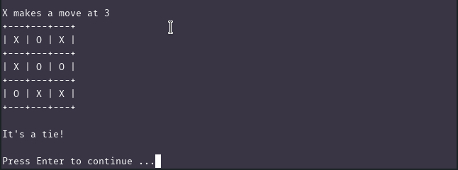

# Tic-Tac-Toe
Tic-Tac-Toe game implementation in Command Line using Python.

. . .

## How to Play
1. Install [Python 3](https://www.python.org/downloads/)
2. Download project ZIP & Extract it
4. Open Terminal or Command Prompt
5. Navigate to `./src` folder inside project
6. Run `python3 play.py`

>__Note__ : Windows user change `os.system("clear")` to `os.system("cls")` inside `./src/play.py` file.

